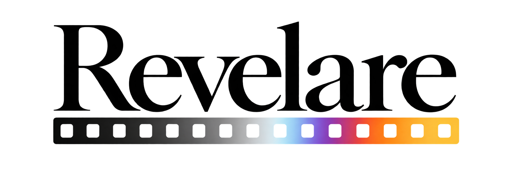
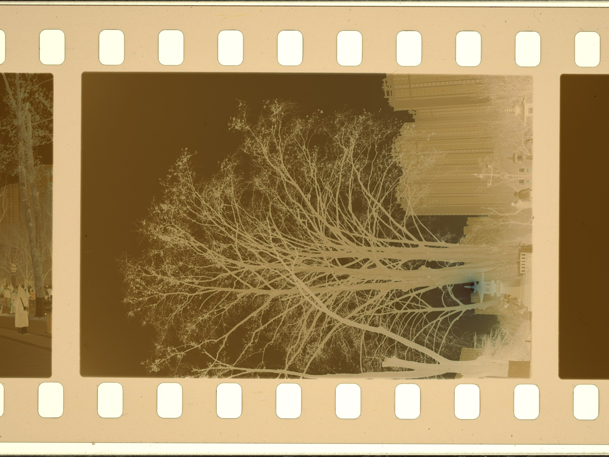
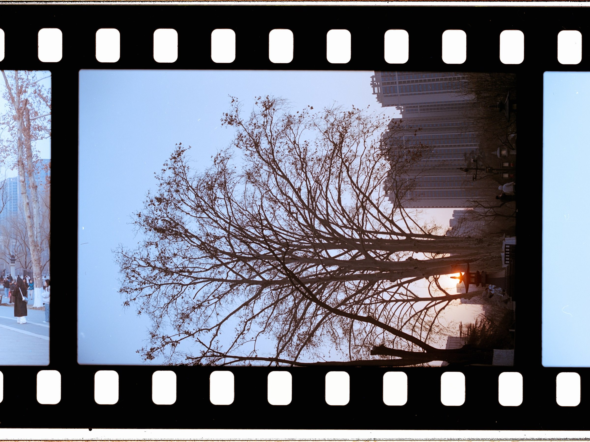
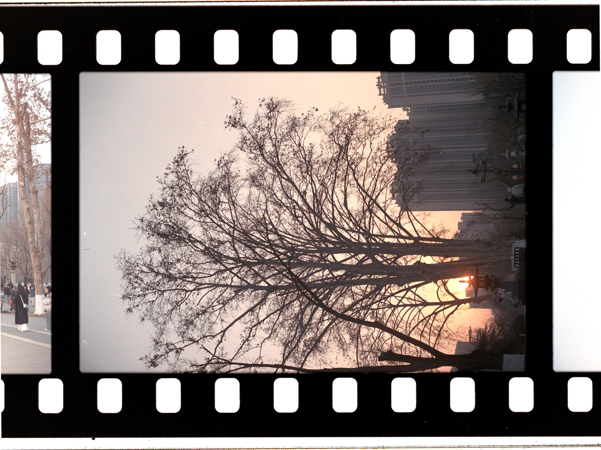

<p align="center">
  
</p>

<h1 align="center">OpenRevelare</h1>

<p align="center">
  
</p>

<p align="center"><b>Physics-based colour-negative reversal</b><br>Convert camera-copied RAW or scanner TIFF into reproducible positives.</p>

<p align="center">
  <a href="https://github.com/Toshihiko-Lin/Open-Revelare/releases/latest"></a>
  <a href="https://github.com/Toshihiko-Lin/Open-Revelare/releases/latest"></a>
  <a href="https://github.com/Toshihiko-Lin/Open-Revelare/releases/latest"></a>
</p>

<p align="center">
  <a href="https://github.com/Toshihiko-Lin/Open-Revelare/releases/latest"></a>
  <a href="https://github.com/Toshihiko-Lin/Open-Revelare/actions/workflows/ci.yml"></a>
  <a href="LICENSE"></a>
</p>

<p align="center"><a href="README.md">中文</a> · <a href="#overview">English</a></p>

<p align="center">
  <a href="#overview">Overview</a> · <a href="#model">Model</a> · <a href="#workflow">Workflow</a> ·
  <a href="#interface-and-examples">Interface</a> · <a href="#features">Features</a> · <a href="#installation">Install</a> ·
  <a href="#building-from-source">Build</a> · <a href="#licence-and-third-party-components">Licence</a>
</p>

---

## Overview

Colour negatives contain an orange base and dye layers. OpenRevelare linearises the input, removes the base, white-balances and inverts it in the Cineon log-density domain, then exports a positive.

- **Explainable**: base, maximum density and channel-balance parameters have defined meanings.
- **Reproducible**: settings are stored in a `.ncproj` beside the image; source files remain untouched.
- **Local-first**: no account or network connection; processing runs in the shared CPU Core.
- **Cross-platform**: C# / .NET 8 + Avalonia for Windows, Linux and macOS.

The application is intended for whole-roll camera-copy and scanning workflows, archival parameters and reproducible reprocessing. It does not provide per-roll colour-chart calibration; use [DiVERE](https://github.com/flipswitchingmonkey/DiVERE) for heritage, commercial-archive or research work that requires it.

## Model

| Stage | Scope | Responsibility |
|---|---|---|
| **FilmBase** | Whole roll | Base transmittance, maximum density, channel balance and inversion parameters |
| **SceneBase** | Single frame | Temperature, exposure, contrast, saturation and curves |

The separation allows physical parameters to be shared across a roll while frame-level edits remain independent.

### Principles

1. **The mask is physical**: measure the base; do not replace measurement with visual guessing.
2. **Density is the computation domain**: the mask is approximately a constant offset, making white balance and inversion predictable.
3. **Restoration and creation are separate**: FilmBase provides consistency; SceneBase provides expression.

## Workflow

1. **Import** RAW, scanner TIFF or another supported image and enter roll metadata.
2. **Calibrate the roll**: estimate the base, white balance, shadow endpoint and `d_max`; correct manually when required.
3. **Apply FilmBase** to the roll or selected frames.
4. **Edit frames** in SceneBase with temperature, exposure, contrast, saturation and curves.
5. **Export** TIFF, JPEG, linear DNG or scene-linear ACEScg TIFF.

Changes are written automatically. The `.ncproj` stays beside the source image.

## Interface and examples

### Cineon calibration

<p align="center"></p>
<p align="center"><sub>Roll thumbnails, the current frame and shared physical parameters on one page.</sub></p>

### Display adjustment

<p align="center"></p>
<p align="center"><sub>Frame-level creative adjustments without changing FilmBase.</sub></p>

<table>
  <tr>
    <td width="50%"></td>
    <td width="50%"></td>
  </tr>
  <tr>
    <td align="center"><sub>Roll management, filtering and project recovery</sub></td>
    <td align="center"><sub>Full-roll contact sheet with sprocket layout and metadata</sub></td>
  </tr>
</table>

### Reversal result

<table>
  <tr>
    <td width="33%"></td>
    <td width="33%"></td>
    <td width="33%"></td>
  </tr>
  <tr>
    <td align="center"><sub>Raw input</sub></td>
    <td align="center"><sub>NLP automatic reversal</sub></td>
    <td align="center"><sub>OpenRevelare result</sub></td>
  </tr>
</table>

## Features

| Category | Capabilities |
|---|---|
| Reversal | Cineon density-domain inversion, auto-calibration, narrow-band light decoupling (Path A), black-and-white negatives |
| Colour | ACEScg workspace; sRGB, Display P3 and Adobe RGB output; ICC management; Stage 2 controls |
| Pre-processing | LCC flat-field, lens distortion, vignetting, sprocket masking and geometry crop in linear light |
| Workflow | Roll management, roll sync, virtual copies, format presets, 80-step undo/redo, histogram and waveform |
| Output | 16-bit TIFF, JPEG, linear DNG and 32-bit float ACEScg TIFF; templates, scaling and sharpening |
| Reports | Per-frame report of input domain, base source and inversion parameters |

Inputs include DNG, NEF, CR2/CR3, ARW, RAF, RW2, ORF, PEF, IIQ, Hasselblad Flextight `.fff`, TIFF, JPEG and PNG.

## How it works

Transmittance `T` is converted to log density:

$$D = -\log_{10}(T)$$

The core operations are:

$$T_{norm} = T / T_{base}$$

$$D_{corr}[c] = D[c] \times w_{high}[c] + w_{offset}[c]$$

$$T_{pos} = 10^{\left(\frac{R_{out}}{D_{max}[c]}D[c]-R_{out}\right)}$$

The per-frame pipeline is: linearisation → optical correction → optional light-source decoupling → base removal → density-domain white balance → inversion → output. The application includes the complete derivation under **Help → Operation guide / Technical theory**.

## Installation

Packages are published on [Releases](https://github.com/Toshihiko-Lin/Open-Revelare/releases/latest) with the .NET runtime included.

| Platform | Package | Status and requirements |
|---|---|---|
| Windows 10/11 x64 | `setup.exe` | Stable; no additional dependency |
| Linux x86_64 | `.AppImage` | Beta; glibc ≥ 2.35 |
| macOS Apple Silicon | `-arm64.dmg` | Beta; macOS 12+, no real-device validation yet |
| macOS Intel | `-x86_64.dmg` | Beta; macOS 12+, no real-device validation yet |

<details>
<summary>Platform notes</summary>

- **Windows**: if SmartScreen appears, select **More info → Run anyway**.
- **macOS**: approve the first launch under **System Settings → Privacy & Security → Open Anyway**, or run:

  ```bash
  xattr -dr com.apple.quarantine /Applications/OpenRevelare.app
  ```

- **Linux**:

  ```bash
  chmod +x OpenRevelare-*.AppImage && ./OpenRevelare-*.AppImage
  ```

  Add `--appimage-extract-and-run` if the package cannot start directly. Linux currently previews through SDR; HDR export remains available.

</details>

## Data locations

| Content | Windows | Linux / macOS |
|---|---|---|
| Settings and roll index | `%APPDATA%\OpenRevelare` | `$XDG_CONFIG_HOME/OpenRevelare/` (default `~/.config`) |
| Contact-sheet cache | `%LOCALAPPDATA%\OpenRevelare\sheets` | `$XDG_CACHE_HOME/OpenRevelare/sheets/` (default `~/.cache`) |
| DNG decode cache | `.revelare-cache/` beside the source | Same |
| Project file | `.ncproj` beside the source | Same |

Cache locations and limits are configurable. Uninstalling does not remove these data.

## Building from source

Requires the [.NET 8 SDK](https://dotnet.microsoft.com/download/dotnet/8.0).

```bash
git clone https://github.com/Toshihiko-Lin/Open-Revelare.git
cd Open-Revelare
dotnet build -c Release
dotnet test -c Release
dotnet run --project src/OpenRevelare.Gui
```

CLI example:

```bash
dotnet run --project src/OpenRevelare.Cli -- -i neg.tiff -o pos.tiff --input-linear --d-max 2.0
```

Read [CONTRIBUTING.md](CONTRIBUTING.md) before development. Calibration experiments are documented in [`docs/calibration/`](docs/calibration/); colour-management decisions are recorded in [`docs/color-management-architecture.md`](docs/color-management-architecture.md).

## Licence and third-party components

The code is licensed under **GPL-3.0-only**; see [LICENSE](LICENSE).

`models/net_awb.onnx` is the Deep White-Balance Editing model, distributed under **CC BY-NC-SA 4.0** and outside this project's GPL scope. See [models/README.md](models/README.md) and [THIRD_PARTY_NOTICES.txt](THIRD_PARTY_NOTICES.txt).

References include [LightSourceDecouple](https://github.com/karasuyasabou/LightSourceDecouple), [DiVERE](https://github.com/flipswitchingmonkey/DiVERE) and darktable `negadoctor`.

## Project origin and acknowledgements

The project began as a personal film-copying tool. After user feedback and a core rewrite, it was released as a cross-platform open-source project in August 2026. Early development was supported by:

- 豆腐
- Caramello_焦糖玛奇朵
- REPEATER000
- jamais
- hhd

## Support the project

The project is maintained independently and released under GPL-3.0-only. If it is useful to your workflow, support is welcome:

<p align="center">
  
  
</p>

## Limitations and feedback

- No per-roll colour-chart calibration.
- 8-bit TIFF may show banding in shadows; 16-bit input is recommended.
- macOS has no real-device validation yet and uses conservative system defaults.

Report issues through [GitHub Issues](https://github.com/Toshihiko-Lin/Open-Revelare/issues) with the OS version, camera or scanner, input format and error details. Do not upload private originals.
