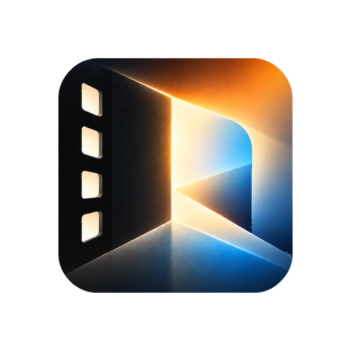
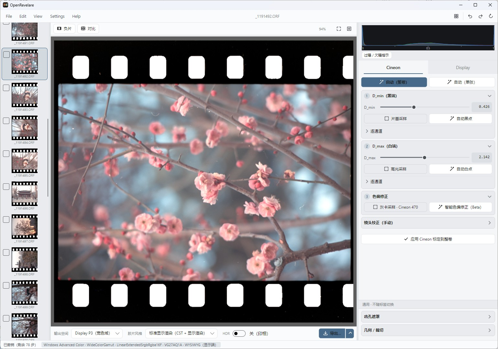
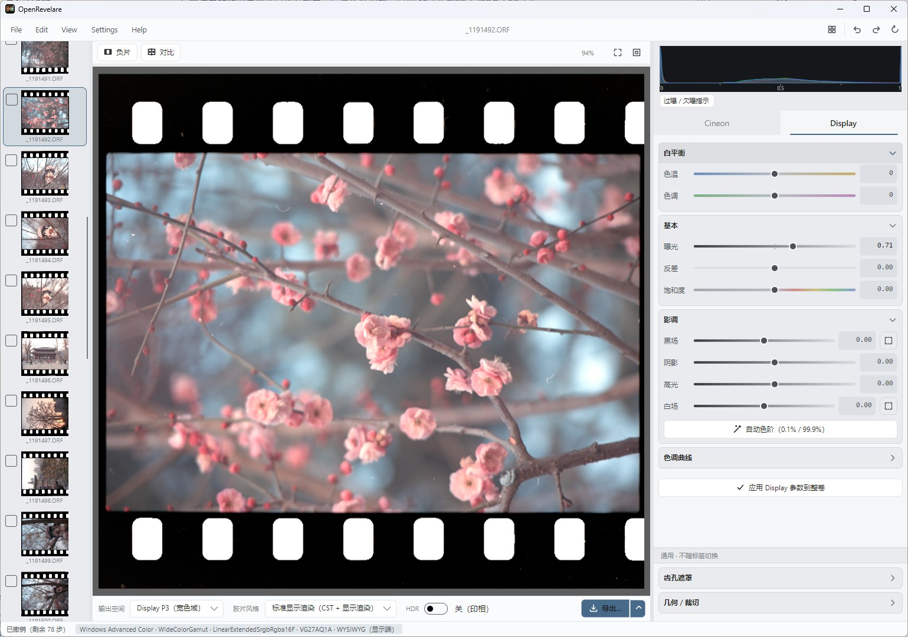
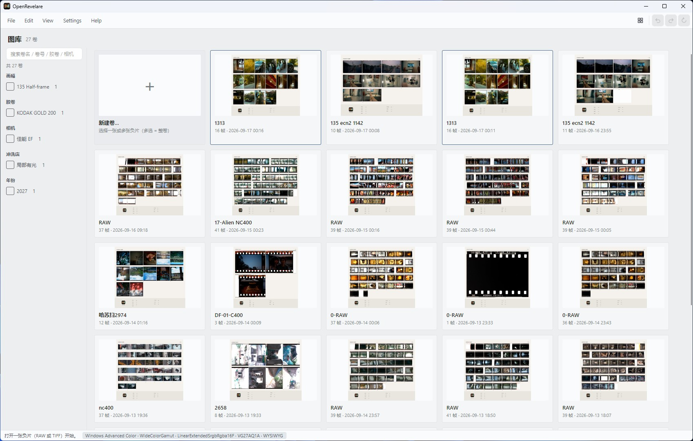
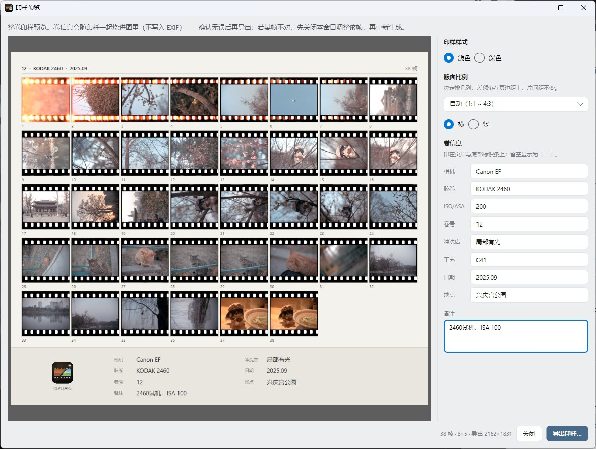

<p align="center">
  
</p>

<h1 align="center">OpenRevelare</h1>

<p align="center">
  <b>从玄学，到物理。</b><br>
  彩色负片的翻拍 RAW 或扫描 TIFF，按光学与数学逐层解算成正片。<br>
  还原交给物理，审美留给你。
</p>

<p align="center">
  <a href="https://github.com/Toshihiko-Lin/Open-Revelare/releases/latest"></a>
  <a href="https://github.com/Toshihiko-Lin/Open-Revelare/releases/latest"></a>
  <a href="https://github.com/Toshihiko-Lin/Open-Revelare/releases/latest"></a>
</p>

<p align="center">
  <a href="https://github.com/Toshihiko-Lin/Open-Revelare/releases/latest"></a>
  <a href="https://github.com/Toshihiko-Lin/Open-Revelare/actions/workflows/ci.yml"></a>
  <a href="LICENSE"></a>
</p>

<p align="center">
  <a href="README.en.md">English</a> · <a href="#这是什么">中文</a>
</p>

<p align="center">
  <a href="https://revelare.netlify.app/">官网</a> ·
  <a href="#这是什么">简介</a> ·
  <a href="#为什么做这个">故事</a> ·
  <a href="#三条原则">原则</a> ·
  <a href="#适合谁">适合谁</a> ·
  <a href="#和主流方案的区别">对比</a> ·
  <a href="#界面">界面</a> ·
  <a href="#下载与安装">下载</a> ·
  <a href="#快速上手">上手</a> ·
  <a href="#功能">功能</a> ·
  <a href="#工作原理">原理</a> ·
  <a href="#从源码构建">构建</a> ·
  <a href="README.en.md">English</a>
</p>

<p align="center">
  
</p>

<p align="center"><sub>主窗口「整卷校准」：左边整卷缩略图，中间当前帧，右栏是这一卷共用的物理参数。</sub></p>

---

## 这是什么

彩色负片有一层橙色的片基（色罩），翻拍或扫描出来的原始文件直接看是偏色的。OpenRevelare 做的事情就是把这层色罩**算掉**：先把输入还原成线性光，修掉镜头的光学问题，再转进对数密度域，按 Cineon 标准做白平衡和反转，最后输出正片。

整个流程里每个参数都有名字、有明确的物理含义。同一卷底片，今天处理、明年处理、换台机器处理，结果都一样——这是「计算」和「拉曲线试手感」的根本区别。

技术栈：C# / .NET 8 + Avalonia，**纯 CPU**，Windows / Linux / macOS 三平台同一份代码。本地优先、非破坏：源文件永不修改，参数存在图片旁边的 `.ncproj` 文件里；不联网、不需要账号。界面中英双语，跟随系统或手动锁定。

## 为什么做这个

作者自己拍胶片，翻拍负片后的去色罩一直很痛苦：主流方案是 Lightroom 插件（Negative Lab Pro、ColorPerfect 之类），锁死 Adobe 付费生态，处理过程是个黑盒——参数不可解释、结果不可复现；免费方案学习曲线又陡。社区里讨论最多的词是「玄学」：同一卷底片，换个人调、换个时间调，出来完全不一样。

OpenRevelare 的想法很简单：把去色罩从「调出来的」变成「算出来的」。彩色负片的色罩是物理存在——片基染料的吸收特性是测量对象，不是审美对象。把反转建立在 Cineon 密度域的物理与数学上，每个参数都有明确的物理含义，同一卷底片任何时候、任何机器上处理，结果都一样。

项目从自用工具起步，做了付费验证（买断制，8 位用户付费支持），再根据用户反馈用 C# 重构底层——速度提升约 13 倍、补齐三平台、老用户处理结果逐像素不变。2026 年 8 月开源，免费，希望也能帮到其他胶片玩家。

## 三条原则

1. **色罩是物理，不是审美**——片基染料的吸收特性是测量对象：采样、扣除、算完，不靠肉眼猜
2. **密度域是负片的母语**——在 log 密度域里，色罩是常量偏移、白平衡和反转是线性操作，结果可复现；在非线性域里这些操作互相纠缠，只能凭手感
3. **还原与创作分开**——物理还原（FilmBase）整卷共用，审美调整（SceneBase）每帧独立，互不污染

## 适合谁

**适合**

- 用相机翻拍或扫描仪出图，手上有整卷要处理，希望一卷之内色调统一
- 不满足于「拉根曲线凭手感」，想了解每一步在物理上做了什么
- 需要结果可复现——归档三年后重开工程，还能算出同一张图

**可能不适合**

- 只想一键出片、不打算理解任何参数：程序有自动标定，但它的价值在于**可以被检查和修正**
- 要求严格色彩还原的场景——文物翻拍、商业存档、科研用途：OpenRevelare 不做逐卷色卡标定，这类需求请用 [DiVERE](https://github.com/flipswitchingmonkey/DiVERE)

对 Gold 200 这类标准 C-41 负片，默认参数与逐卷标定的差别在屏幕上略可察觉、打印几乎分辨不出；染料特性偏离基准较远的卷差别大一些，但改一下标定或在 SceneBase 阶段微调就能补回大部分。

## 和主流方案的区别

| | 生态插件（NLP / ColorPerfect 等） | 硬件校正（DiVERE） | OpenRevelare |
|---|---|---|---|
| 形态 | Lightroom/PS 插件 | 独立软件 | 独立软件 |
| 生态 | 锁死 Adobe，$99+ | 免费开源 | 免费开源 |
| 处理 | 黑盒，不可解释 | 物理可解释 | 物理可解释 |
| 门槛 | 低 | 需色卡 + 窄谱光源 | 零门槛，翻拍直出 |
| 结果 | 不可复现 | 可复现 | 可复现（每参数有物理含义） |

一句话：生态插件把去色罩当滤镜卖，硬件校正把精度建立在额外器材上，OpenRevelare 走的是「免硬件 + 可解释 + 可复现」的路。

## 界面

一个窗口走完一整卷。第一页「整卷校准」：片基透射率 `t_base`、`d_max`、暗部与亮部两段白平衡、齿孔遮罩、几何裁切。先标定当前帧，再应用到整卷，其余帧共用同一套物理参数。

<p align="center">
  
</p>

<p align="center"><sub>第二页「帧编辑」：色温色调、曝光、黑场 / 阴影 / 高光 / 白场、反差与饱和度，底部是 W / R / G / B 四通道曲线，背景叠着实时直方图。审美只动这一页，物理还原的结果不受影响。</sub></p>

<table>
  <tr>
    <td width="50%"></td>
    <td width="50%"></td>
  </tr>
  <tr>
    <td valign="top"><sub><b>图库</b>　打开软件先看到卷，不是空编辑器。每卷一张印样封面，底下写着胶卷、机身、冲洗日期与帧数，双击进卷继续上次的进度。</sub></td>
    <td valign="top"><sub><b>印样</b>　冲印店风格的整版印样，带齿孔排版，卷信息随图一起烧进画面。深浅两种样式，导出的都是整张大图，可直接归档或打印。</sub></td>
  </tr>
</table>

## 下载与安装

发行包在 [Releases](https://github.com/Toshihiko-Lin/Open-Revelare/releases/latest)，自带 .NET 运行时，不需要另外装任何东西。

| 平台 | 包 | 要求 | 成熟度 |
|---|---|---|---|
| Windows 10/11 x64 | `setup.exe` | 无 | **正式版** —— 开发机就是它，每次发版实测 |
| Linux x86_64 | `.AppImage` | glibc ≥ 2.35（Ubuntu 22.04 / Debian 12 及以上） | **公测** |
| macOS Apple Silicon | `.dmg` | macOS 12 或更高 | **公测，从未在真机上跑过** |

<details>
<summary><b>Windows</b> —— 「Windows 已保护你的电脑」怎么办</summary>

双击安装包，一路下一步即可。

若弹出蓝色的「Windows 已保护你的电脑」，点 **更多信息 → 仍要运行**。这是 SmartScreen 对未购买代码签名证书的软件的例行提示，不是病毒警告。

</details>

<details>
<summary><b>macOS</b> —— 「已损坏，无法打开」怎么办</summary>

打开 dmg，把 OpenRevelare 拖进「应用程序」。

首次打开会提示「已损坏」或「无法验证开发者」。**不是文件损坏**，是没有买 Apple 开发者计划（99 美元/年）、未经公证。任选一种方式绕过：

```bash
xattr -dr com.apple.quarantine /Applications/OpenRevelare.app
```

或者双击一次（会被拦下），再到 **系统设置 → 隐私与安全性 → 仍要打开**。

> 别照着网上的「右键 → 打开」做：macOS 15 (Sequoia) 起 Apple 取消了那个入口。

**公测说明**：macOS 版由云端构建，作者没有 Mac 设备，没有任何一次真机运行记录。已知短板：`SystemMemory` 无 mac 实现，解码并发是保守固定档；没有 Adobe DNG Converter 回退路径。**欢迎开 issue 回报**，尤其是 RAW 能不能导入。

</details>

<details>
<summary><b>Linux</b> —— AppImage 怎么跑</summary>

AppImage 是单文件绿色程序，不用安装，放哪都行。加上可执行权限后双击或在终端运行：

```bash
chmod +x OpenRevelare-*.AppImage && ./OpenRevelare-*.AppImage
```

（在文件管理器里：右键 → 属性 → 权限 → 勾「可执行」）

本包自带 FUSE，不需要额外装 libfuse2。若系统实在起不来，加 `--appimage-extract-and-run` 参数运行。

</details>

## 快速上手

1. **导入**——把翻拍或扫描的底片文件拖进窗口，输入卷信息（胶卷、机身、冲洗日期）
2. **整卷校准**——在「整卷校准」页标定当前帧：自动标定会估片基、白平衡、反差等，不满意可手动修正
3. **应用到整卷**——把这套物理参数同步给整卷，其余帧共用
4. **帧编辑**——逐帧在「帧编辑」页做审美调整：色温、曝光、对比度、饱和度、曲线
5. **导出**——8/16-bit TIFF 或 JPEG，可嵌 ICC profile

全程没有「保存」按钮——改动自动落盘，`.ncproj` 与源文件放在一起。

## 功能

### 成像

- **密度域反转**——片基 `t_base`、逐通道亮端密度 `d_max_per_channel`（白端）、逐通道暗端密度（黑端）、扫描曝光，每一项都在界面中可调且有明确的物理含义。反转是**双端模型**：两端都是该通道的**真实密度读数**，斜率由两端相减导出，通道间之差**就是**白平衡——白平衡不是加在端点之后的一道工序，而是端点本身。不存在独立的 gamma、色度或 `wb_high` 修正系数（早期版本的 `grade` / `pivot` / `chroma_grade` / `wb_high` 已全部移除）
- **完整色彩管理**——工作空间 ACEScg（宽色域，场景参考）承载反相；输出空间在主窗口选（sRGB / Display P3 / Adobe RGB），帧编辑即在该空间内进行，导出所见即所得；也可导出场景线性 ACEScg 交给外部调色
- **窄带光源解耦（Path A）**——用 LED / 荧光灯箱翻拍时，三通道之间的串扰可以靠一组 R/G/B 标定帧解算出 3×3 矩阵消掉。做法源自 [LightSourceDecouple](https://github.com/karasuyasabou/LightSourceDecouple)
- **自动标定**——从整卷估片基、齿孔阈值、暗端谷底、`d_max`、亮部白平衡
- **智能白平衡**——DeepWB 神经网络一键估算白点（模型单独授权，[见下](#智能白平衡模型--单独授权请读一下)）
- **预反转校正**——LCC 平场、镜头畸变、暗角、齿孔遮罩，全部在线性光域完成
- **Stage 2 调整**——曝光 / 色阶 / 对比度 / 高光阴影 / PCHIP 曲线 / 饱和度

### 工作流

- **按卷管理**——导入即建卷，图库卷墙用每卷的印样当封面，可按画幅、胶卷等分类筛选
- **无「保存」动作**——改完自动落盘。`.ncproj` 与源图像放在一起，拷盘换机跟着片子走
- **整卷同步**——虚拟副本、整卷或勾选帧同步标定与场景
- **画幅预设**——135 全幅（含边框）/ 半格 / XPan / 645 / 6×6 / 6×7 / 6×9 / 6×12
- **80 步撤销重做**（整卷快照，连续微调自动合并）
- **冲印店风格整版印样**，底部自带卷标识条

### 输入输出

| | |
|---|---|
| **RAW 输入** | DNG / NEF / CR2 / CR3 / ARW / RAF / RW2 / ORF / PEF / IIQ 等（LibRaw） |
| **其他输入** | TIFF / JPEG / PNG |
| **导出** | 16-bit TIFF、JPEG，三种输出色彩空间（另可导出场景线性 ACEScg），嵌入的 ICC 与实际像素一致 |

## 工作原理

### 为什么是密度域

彩色负片的信号天然是密度。透射率 T 取负对数——`D = -log10(T)`——得到对数密度，这正是 Cineon 胶片扫描标准采用的域。在这个域里，R/G/B 三通道的关系是线性的、可预测的：片基色罩近似一个常量偏移，扣除它只需一次减法；白平衡、反转都是线性操作。在非线性域里这些操作互相纠缠，只能靠手感试——这就是「玄学」的来源，也是 OpenRevelare 选择密度域的根因。

### 两个阶段：FilmBase 与 SceneBase

|  | **FilmBase · 物理还原** | **SceneBase · 审美调整** |
|---|---|---|
| 描述的是 | 这卷胶片客观存在的物理属性：片基的颜色与密度、最大密度、通道平衡、反转对比度 | 色温偏好、曝光亮度、对比度风格、最终饱和度 |
| 性质 | 不是审美选择，是测量结果。同一卷共用同一套 | 同一张底片可以有完全不同的设定，每帧各调各的 |
| 改的是 | 反转方程的**输入**——重算物理还原 | 反转方程的**输出**——在还原结果上调整 |

两阶段分开的意义：物理还原算对一次，整卷通用；后面怎么改，都不会把物理基础搞乱。这里的「物理还原」指仅依据这卷胶片本身的信息（片基、最大密度、通道平衡）推算出的去色罩结果，不含任何主观调整。

### 核心公式

从采样到正片，关键步骤都可以写成一行：

**片基归一化**——每通道除以采样的片基透射率，橙色色罩一步扣掉：

$$T_\text{norm} = T / T_\text{base}$$

**转入密度域**——透射率取负对数（下限截断防溢出）：

$$D = -\log_{10}\!\bigl(\max(T_\text{norm},\ 10^{-D_\text{max}})\bigr)$$

**密度域白平衡**——阴影端加法项 + 高光端乘法项（Negadoctor 双端模型）：

$$D_\text{corr}[c] = D[c] \times w_\text{high}[c] + w_\text{offset}[c]$$

**反转**——双端模型：片基把每个通道的黑端归零，白端是该通道实测的最大密度 $D_{\max}[c]$，斜率是两端相减的结果而不是另设的参数：

$$D_\text{adj}[c] = \frac{R_\text{out}}{D_{\max}[c]} \times D[c] - R_\text{out}$$

$$T_\text{pos} = 10^{D_\text{adj}}$$

每个参数的完整推导见应用内「帮助 → 技术原理」。

### 单帧处理管线

1. **还原成光**——翻拍 RAW 关掉相机的一切美化，由 LibRaw 解到线性；带显示 gamma 的扫描件一键线性化。两种输入回到同一条线性光起跑线
2. **线性域校正**——畸变、LCC 平场、暗角，以及齿孔 / 灯板遮罩。光学瑕疵只有在「光」的状态下修才物理正确
3. **光源解耦**（可选）——白光直通，或走 RGB 三色分离，后者能精确测量并分离染料层间的串扰
4. **扣除色罩，进入密度域**——用采样的片基橙色透射率抵消色罩，信号转入对数密度域，算法建立在 Cineon 标准之上
5. **密度域白平衡**——暗部与亮部分别校正，且必须先暗后亮。这个顺序正是物理推算与随手拉曲线的根本区别
6. **反转**——按胶片自身的 gamma 解算回场景亮度。不是「补回相纸的对比度」：Cineon 是密度的存储编码，negadoctor 也一样，两者都不含相纸环节
7. **输出**——得到一张物理上正确的正片。可以喂给调色软件继续创作，也可以在 Stage 2 里直接调完导出

程序内 **帮助 → 操作指引 / 技术原理** 有完整的使用说明与物理推导。

## 数据放在哪

| 内容 | Windows | Linux / macOS | 可否自定义 |
|---|---|---|---|
| 设置、卷目录索引 | `%APPDATA%\OpenRevelare` | `$XDG_CONFIG_HOME`（缺省 `~/.config`）下的 `OpenRevelare/` | 固定 |
| 卷封面印样缓存 | `%LOCALAPPDATA%\OpenRevelare\sheets` | `$XDG_CACHE_HOME`（缺省 `~/.cache`）下的 `OpenRevelare/sheets/` | ✅ 目录 + 上限（默认 1 GB） |
| 线性 DNG 解码缓存 | 默认跟着源文件放 `.revelare-cache/` | 同左 | ✅ 目录 + 上限（默认 5 GB），会话级 |
| 工程 `.ncproj` | 随片放在源图像文件夹 | 同左 | 由你放照片的位置决定 |

DNG 缓存默认贴着源文件而不是系统盘，是因为 60 MP 一帧转出来约 349 MB。两个缓存都能改位置、都有上限、都在偏好设置里显示当前占用。卸载不碰以上任何目录。

macOS 与 Linux 共用 XDG 路径，没有改用 `~/Library/Application Support`——全线一条代码路径。

## 从源码构建

需要 [.NET 8 SDK](https://dotnet.microsoft.com/download/dotnet/8.0)。

```bash
git clone https://github.com/Toshihiko-Lin/Open-Revelare.git
cd Open-Revelare
dotnet build -c Release
dotnet run --project src/OpenRevelare.Gui
```

命令行前端（无 GUI，同一个 Core）：

```bash
dotnet run --project src/OpenRevelare.Cli -- -i neg.tiff -o pos.tiff --d-max 2.0
dotnet run --project src/OpenRevelare.Cli -- --help
```

### 打包

```bash
# Windows —— 需 Inno Setup 6
dotnet publish src/OpenRevelare.Gui -c Release -r win-x64 --self-contained true -o publish/win-x64
ISCC.exe open-revelare.iss                     # → installer/OpenRevelare-{版本}-setup.exe

# Linux —— 需在 Linux 上跑（脚本会自动下载 appimagetool）
./packaging/linux/build-appimage.sh            # → installer/OpenRevelare-{版本}-x86_64.AppImage

# macOS —— 需在 mac 上跑
./packaging/macos/bundle-libraw.sh             # 编译 LibRaw 0.21.4（NuGet 没有 mac runtime 包）
./packaging/macos/build-app.sh --dmg           # → installer/OpenRevelare-{版本}-{arch}.dmg
```

`dotnet publish -r linux-x64` / `-r osx-arm64` **在 Windows 上也能跑**，但 `appimagetool`、`codesign`、`hdiutil` 必须在对应系统上执行。三平台产物由 [`.github/workflows/release.yml`](.github/workflows/release.yml) 打 tag 自动构建。

> **macOS 的 LibRaw 必须锁 0.21.x**：Sdcb.LibRaw 0.21.1.7 按 0.21 的 `libraw_data_t` 布局 marshal，brew 上的 0.22 加过字段，偏移全错。`bundle-libraw.sh` 因此锁 0.21.4 源码编译。

## 智能白平衡模型 —— 单独授权，请读一下

「智能白平衡」用到 Deep White-Balance Editing (CVPR 2020) 的网络权重 `models/net_awb.onnx`。它随仓库和发行包一起分发，但——

> [!IMPORTANT]
> **这个文件不在本项目 GPL-3.0 授权的范围内。**
> 它按原作者的 **CC BY-NC-SA 4.0**（署名 — 非商业 — 相同方式共享）分发。

OpenRevelare 免费、不销售、无订阅无内购，分发本身不以商业利益为目的，因此符合 NC 条款。但**你从 GPL-3.0 拿到的「可以商业再分发」这项权利不适用于这个文件**——要商用请先删掉 `models/` 目录。程序照常构建运行，只有「智能白平衡」一个功能会提示模型未找到；手动白平衡、自动亮部白平衡、Path A 解耦都不依赖它。

细节见 [models/README.md](models/README.md) 与 [THIRD_PARTY_NOTICES.txt](THIRD_PARTY_NOTICES.txt) 第 13 条。作者要求引用其论文。

## 许可证

本项目的代码以 **GPL-3.0-only** 授权，见 [LICENSE](LICENSE)。

**例外**：`models/net_awb.onnx` 是第三方资产，按 CC BY-NC-SA 4.0 单独授权，不在上述 GPL-3.0 范围内，见 [models/README.md](models/README.md)。

随二进制分发的第三方组件及其许可见 [THIRD_PARTY_NOTICES.txt](THIRD_PARTY_NOTICES.txt)——其中 LibRaw 走 LGPL-2.1，带上这份声明不是可选项。

## 致谢

- [LightSourceDecouple](https://github.com/karasuyasabou/LightSourceDecouple)（MIT）—— 窄带 RGB 解耦（Path A）的做法出自这里
- [DiVERE](https://github.com/flipswitchingmonkey/DiVERE)（MIT）—— 密度域色彩模型的参照
- darktable 的 `negadoctor` 模块 —— 参照其数学模型 `D_corr = D × wb_high + wb_offset`

**致谢名单**

感谢以下用户对软件早期开发与完善提供的支持：
- 豆腐
- Caramello_焦糖玛奇朵
- REPEATER000
- jamais
- hhd


反馈与 bug 请开 [issue](https://github.com/Toshihiko-Lin/Open-Revelare/issues)，附上系统版本、相机或扫描仪型号、输入格式与错误信息。请不要上传含隐私内容的原片。

## 已知限制


- 不做逐卷色卡标定：追求严格色彩精度（文物翻拍、商业存档、科研）请用 DiVERE
- 8-bit TIFF 输入暗部可能出现轻微色带，建议扫描时导出 16-bit
- macOS 真机验证与 `SystemMemory` 实现（macOS 版从未在真机运行，解码并发为保守固定档）

## 打赏

Revelare 最早是自己做着玩的小工具。当时开发花了不少成本，就把大部分功能开放，只给几个进阶的翻拍工作流定价，补贴一点。后来真的有人愿意购买支持——非常感谢。

之后听取了很多人的意见，重构了一遍，补上三平台支持，做到觉得完成度差不多了，可能对其他玩家或开发者也能带来一些实在的启发，因此开源。胶片圈子不大，工具也不嫌多，算是对社区的一点回馈。如果觉得有用，可以请我喝杯咖啡。

<p align="center">
  
</p>
